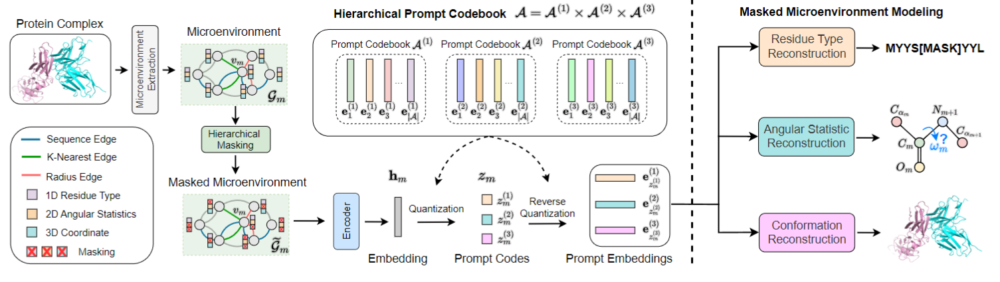

# Prompt-DDG
**Learning to Predict Mutational Effects of Protein-Protein Interactions by Microenvironment-aware Hierarchical Prompt Learning**

Lirong Wu, Yijun Tian, Haitao Lin, Yufei Huang, Siyuan Li, Nitesh V Chawla, Stan Z. Li. In [ICML](https://openreview.net/forum?id=g89jAdrnAF), 2024.

<p align="center">
  
</p>


## Dependencies

```
conda env create -f environment.yml
conda activate Prompt-DDG
```
The default PyTorch version is 1.8.1 and cudatoolkit version is 11.3. They can be changed in `environment.yml`.


## Dataset

| Dataset   | Download Script                                    |
| --------- | -------------------------------------------------- |
| [SKEMPI v2](https://life.bsc.es/pid/skempi2) | [`data/get_skempi_v2.sh`](./data/get_skempi_v2.sh) |


## Usage

### Codebook Pre-training and DDG Prediction

```
python -B train.py
```

The customized hyperparameters  are available in `./configs/param_config.json`.


### Loading the Pre-trained Model and Making Inference

We provide a pre-trained model in [Google Drive](https://drive.google.com/file/d/10Cqp42Q-hp2Dm0278EdpCfvKpMKBeiu_/view?usp=sharing) for DDG prediction on SKEMPI v2. To use it, please download it to  `./trained_models/` and run

```
python -B train.py --ckpt_path ../trained_models/ddg_model.ckpt
```


## Citation

If you are interested in our repository and our paper, please cite the following paper:

```
@article{wu2024mape,
  title={MAPE-PPI: Towards Effective and Efficient Protein-Protein Interaction Prediction via Microenvironment-Aware Protein Embedding},
  author={Wu, Lirong and Tian, Yijun and Huang, Yufei and Li, Siyuan and Lin, Haitao and Chawla, Nitesh V and Li, Stan Z},
  journal={arXiv preprint arXiv:2402.14391},
  year={2024}
}
```


## Feedback

If you have any issue about this work, please feel free to contact me by email: 
* Lirong Wu: wulirong@westlake.edu.cn
